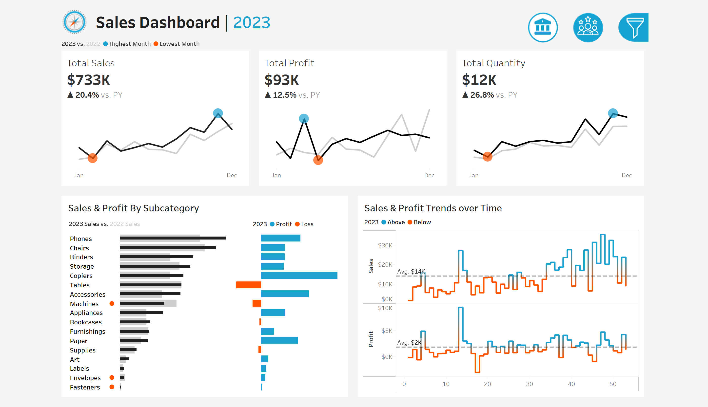
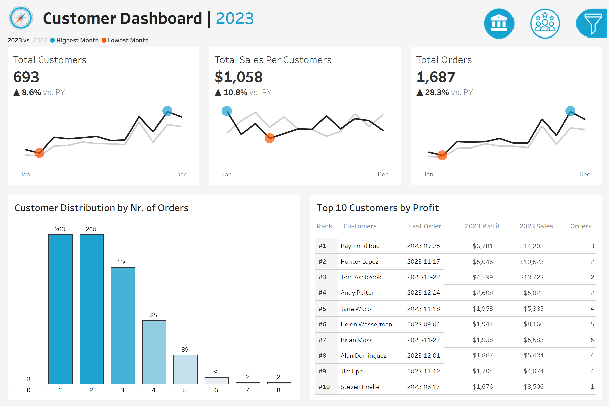
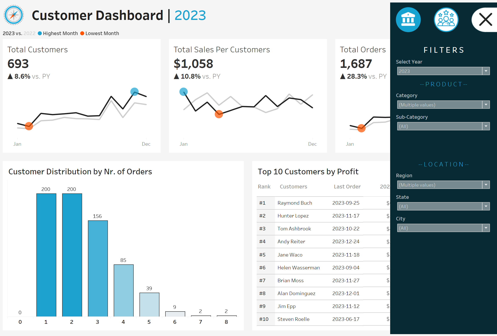

# Sales-Dashboard-Tableau-Project

# 📊 Tableau Sales & Customer Analytics Dashboard
🔗 Live Dashboard

👉  [Tableau Public: View Interactive Dashboard](https://public.tableau.com/views/SalesCustomerDashboards_17717198680510/SalesDashboard?:language=en-US&publish=yes&:sid=&:redirect=auth&:display_count=n&:origin=viz_share_link)

## 📚 Reference
Methodology adapted from:  
[https://www.datawithbaraa.com/wiki/tableau#tableau-sales-project](https://www.datawithbaraa.com/wiki/tableau#tableau-sales-project)

## 🧭 Project Overview (Updated)

This project delivers two interactive Tableau dashboards designed to support data-driven decision-making for sales and marketing stakeholders.

### Dashboards Provide:
- Year-over-year performance analysis
- Product and customer insights
- Interactive filtering by geography and category
- Behavioral and profitability analysis

### Data Source
- **Dataset:** Four sales and customer transaction files
  - `Orders.csv` – 9,994 records × 13 columns
  - `Customers.csv` – 793 records × 2 columns
  - `Products.csv` – 1,894 records × 4 columns
  - `Location.csv` – 632 records × 4 columns
- **Source:** Publicly available sales datasets from DataWithBaraa
- **Period:** 3 years of transaction records (2019–2021)
- **Key Fields:** OrderDate, ProductCategory, ProductSubcategory, Sales, Profit, Quantity, CustomerID, Region
- **Preprocessing:** Standardized field names, validated metrics, created calculated fields (YoY Growth, Avg Weekly Sales, Customer Profit Ranking)

The solution follows a structured analytics workflow from business requirements to decision-ready visualization.

## 🧠 Analytical Workflow

To demonstrate a professional BI development process, the project was executed using a structured, step-by-step methodology.

### STEP 1 — Requirements Analysis
**Business Questions**  
**Sales Performance**
- How has sales performance changed year-over-year?
- Which product segments drive revenue and profit?
- Are there seasonal or abnormal patterns?

**Customer Insights**
- How does customer value change over time?
- What distinguishes high-value customers?
- How are customers distributed by engagement level?

**Design Strategy**
- KPI → Trend → Comparison → Distribution structure
- Year-over-year comparability across all metrics
- Interactive exploration prioritized

### STEP 2 — Data Source Preparation
**Data Modeling Tasks**
- Connected and validated dataset structure
- Standardized field names and data types
- Created analytical calculated fields
- Verified metric definitions before visualization

**Key Calculated Metrics**
- Year-over-Year Growth
- Average Weekly Sales
- Customer Profit Ranking
- Sales per Customer

This step ensures consistent interpretation across all dashboards.

### STEP 3 — Analytical Visualization Development
**Sales Analysis Visualizations**
- Monthly KPI Trends with YoY Comparison
- Product Subcategory Performance
- Weekly Sales vs Average Benchmark
- Sales vs Profit Relationship

**Customer Analysis Visualizations**
- Customer Growth Trends
- Customer Distribution by Order Frequency
- Top 10 Customers by Profit
- Customer Value Indicators

**Visualization Design Principles**
- Remove non-essential visual elements
- Highlight deviations and performance signals
- Use color as an analytical indicator
- Prioritize interpretability over decoration

### STEP 4 — Dashboard Construction
**📈 Sales Dashboard**
- **Purpose:** Monitor business performance and identify growth drivers
- **Features:**
  - KPI summary (Sales, Profit, Quantity)
  - Monthly performance trends
  - Product category comparison
  - Weekly performance monitoring

**👥 Customer Dashboard**
- **Purpose:** Understand customer behavior and value segmentation
- **Features:**
  - Customer KPI overview
  - Customer trend analysis
  - Order distribution analysis
  - Top 10 high-value customers

## 🎛 Interactivity & User Experience
**Interactive Capabilities**
- Dynamic year selection
- Navigation between dashboards
- Chart-based filtering
- Geographic and product filters

**UX Design Principles**
- Information hierarchy: KPI → Trend → Detail
- Fast insight discovery
- Consistent comparison framework

## 📊 Business Insights Enabled
The dashboards support key business decisions such as:
- Identifying revenue growth drivers
- Evaluating product profitability
- Understanding customer loyalty patterns
- Detecting performance anomalies

## 🛠 Tools & Technologies
- Tableau
- Data Modeling
- Business Intelligence Design
- KPI Framework Development

## 📷 Dashboard Preview
**Sales Dashboard**  

**Customer Dashboard**  

**Filters**  

## 💡 Skills Demonstrated
- End-to-end analytics project execution
- Business-focused dashboard design
- Comparative performance analysis
- Interactive data storytelling
- Structured problem-solving workflow
